### Escuela Colombiana de Ingeniería
### Arquitecturas de Software - ARSW
## Ejercicio Introducción al paralelismo - Hilos - Caso BlackListSearch

### Dependencias:
####   Lecturas:
*  [Threads in Java](http://beginnersbook.com/2013/03/java-threads/)  (Hasta 'Ending Threads')
*  [Threads vs Processes]( http://cs-fundamentals.com/tech-interview/java/differences-between-thread-and-process-in-java.php)

### Descripción
  Este ejercicio contiene una introducción a la programación con hilos en Java, además de la aplicación a un caso concreto.
  
**Nombres:**
- David Santiago Palacios Pinzón.
- Diego Fernando Chavarro Castillo.

**Parte I - Introducción a Hilos en Java**

1. De acuerdo con lo revisado en las lecturas, complete las clases CountThread, para que las mismas definan el ciclo de vida de un hilo que imprima por pantalla los números entre A y B.
2. Complete el método __main__ de la clase CountMainThreads para que:
	1. Cree 3 hilos de tipo CountThread, asignándole al primero el intervalo [0..99], al segundo [99..199], y al tercero [200..299].
	2. Inicie los tres hilos con 'start()'.
	3. Ejecute y revise la salida por pantalla. 
   - Al realizar el procedimiento, observamos que los numeros no se imprimen en orden del 0 al 299,
   sino que se ejecutan en un orden diferente debido a que los hilos se ejecutan "al mismo tiempo" o concurrentemente.
	4. Cambie el incio con 'start()' por 'run()'. Cómo cambia la salida?, por qué?.
   - Al realizar la ejecución con el metodo run, se ejecutan los numeros del 0 al 299 en orden, esto ocurre ya que al llamar al metodo run,
   es como si llamaramos a un metodo cualquiera.

**Parte II - Ejercicio Black List Search**

Para un software de vigilancia automática de seguridad informática se está desarrollando un componente encargado de validar las direcciones IP en varios miles de listas negras (de host maliciosos) conocidas, y reportar aquellas que existan en al menos cinco de dichas listas. 

Dicho componente está diseñado de acuerdo con el siguiente diagrama, donde:

- HostBlackListsDataSourceFacade es una clase que ofrece una 'fachada' para realizar consultas en cualquiera de las N listas negras registradas (método 'isInBlacklistServer'), y que permite también hacer un reporte a una base de datos local de cuando una dirección IP se considera peligrosa. Esta clase NO ES MODIFICABLE, pero se sabe que es 'Thread-Safe'.

- HostBlackListsValidator es una clase que ofrece el método 'checkHost', el cual, a través de la clase 'HostBlackListDataSourceFacade', valida en cada una de las listas negras un host determinado. En dicho método está considerada la política de que al encontrarse un HOST en al menos cinco listas negras, el mismo será registrado como 'no confiable', o como 'confiable' en caso contrario. Adicionalmente, retornará la lista de los números de las 'listas negras' en donde se encontró registrado el HOST.

Al usarse el módulo, la evidencia de que se hizo el registro como 'confiable' o 'no confiable' se dá por lo mensajes de LOGs:

INFO: HOST 205.24.34.55 Reported as trustworthy

INFO: HOST 205.24.34.55 Reported as NOT trustworthy

Al programa de prueba provisto (Main), le toma sólo algunos segundos análizar y reportar la dirección provista (200.24.34.55), ya que la misma está registrada más de cinco veces en los primeros servidores, por lo que no requiere recorrerlos todos. Sin embargo, hacer la búsqueda en casos donde NO hay reportes, o donde los mismos están dispersos en las miles de listas negras, toma bastante tiempo.

Éste, como cualquier método de búsqueda, puede verse como un problema [vergonzosamente paralelo](https://en.wikipedia.org/wiki/Embarrassingly_parallel), ya que no existen dependencias entre una partición del problema y otra.

Para 'refactorizar' este código, y hacer que explote la capacidad multi-núcleo de la CPU del equipo, realice lo siguiente:

1. Cree una clase de tipo Thread que represente el ciclo de vida de un hilo que haga la búsqueda de un segmento del conjunto de servidores disponibles. Agregue a dicha clase un método que permita 'preguntarle' a las instancias del mismo (los hilos) cuantas ocurrencias de servidores maliciosos ha encontrado o encontró.

R// Creamos la clase `HostBlackListsThread` que hereda de `Thread`, la cual recibe el rango de bbsqueda (`startIndex`, `endIndex`) y la IP. Se implementaron los metodos `getOccurrencesCount()`, `getBlackListIndices()` y `getCheckedListsCount()` para obtener los resultados de cada hilo tras su ejecución.

2. Agregue al método 'checkHost' un parámetro entero N, correspondiente al número de hilos entre los que se va a realizar la búsqueda (recuerde tener en cuenta si N es par o impar!). Modifique el código de este método para que divida el espacio de búsqueda entre las N partes indicadas, y paralelice la búsqueda a través de N hilos. Haga que dicha función espere hasta que los N hilos terminen de resolver su respectivo sub-problema, agregue las ocurrencias encontradas por cada hilo a la lista que retorna el método, y entonces calcule (sumando el total de ocurrencuas encontradas por cada hilo) si el número de ocurrencias es mayor o igual a _BLACK_LIST_ALARM_COUNT_. Si se da este caso, al final se DEBE reportar el host como confiable o no confiable, y mostrar el listado con los números de las listas negras respectivas. Para lograr este comportamiento de 'espera' revise el método [join](https://docs.oracle.com/javase/tutorial/essential/concurrency/join.html) del API de concurrencia de Java. Tenga también en cuenta:

R// modificamos `checkHost` para recibir `N` y dividir el total de servidores entre `N` hilos. manejamos el residuo (`totalServers % n`) para asegurar que todos los servidores sean revisados. Utilizamos `thread.join()` para esperar a que todos los hilos terminen antes de consolidar los resultados y realizar el reporte final. Además, se garantizó que el log de "Checked Black Lists" muestre el total acumulado de listas revisadas por todos los hilos.

	* Dentro del método checkHost Se debe mantener el LOG que informa, antes de retornar el resultado, el numero de listas negras revisadas VS. el numero de listas negras total (línea 60). Se debe garantizar que dicha información sea verídica bajo el nuevo esquema de procesamiento en paralelo planteado.

	* Se sabe que el HOST 202.24.34.55 está reportado en listas negras de una forma más dispersa, y que el host 212.24.24.55 NO está en ninguna lista negra.

**Parte II.I Para discutir la próxima clase (NO para implementar aún)**

La estrategia de paralelismo antes implementada es ineficiente en ciertos casos, pues la búsqueda se sigue realizando aún cuando los N hilos (en su conjunto) ya hayan encontrado el número mínimo de ocurrencias requeridas para reportar al servidor como malicioso. Cómo se podría modificar la implementación para minimizar el número de consultas en estos casos?, qué elemento nuevo traería esto al problema?

**Parte III - Evaluación de Desempeño**

A partir de lo anterior, implemente la siguiente secuencia de experimentos para realizar las validación de direcciones IP dispersas (por ejemplo 202.24.34.55), tomando los tiempos de ejecución de los mismos (asegúrese de hacerlos en la misma máquina):

1. Un solo hilo.
2. Tantos hilos como núcleos de procesamiento (haga que el programa determine esto haciendo uso del [API Runtime](https://docs.oracle.com/javase/7/docs/api/java/lang/Runtime.html)).
3. Tantos hilos como el doble de núcleos de procesamiento.
4. 50 hilos.
5. 100 hilos.

Al iniciar el programa ejecute el monitor jVisualVM, y a medida que corran las pruebas, revise y anote el consumo de CPU y de memoria en cada caso. 

Con lo anterior, y con los tiempos de ejecución dados, haga una gráfica de tiempo de solución vs. número de hilos. Analice y plantee hipótesis con su compañero para las siguientes 질문 (puede tener en cuenta lo reportado por jVisualVM):

---
#### MAQUINA 1:
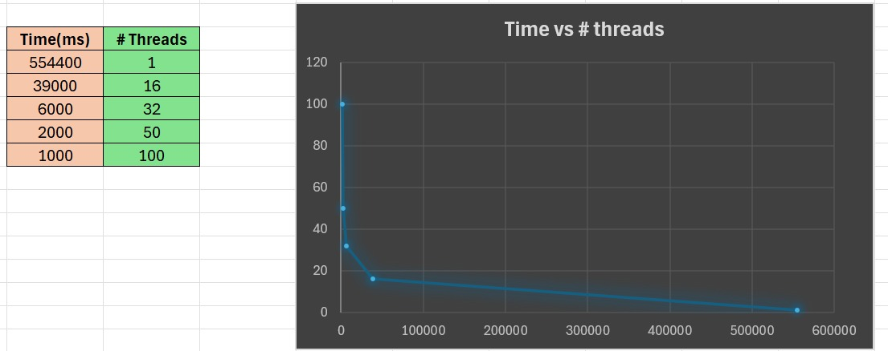

**1 Hilo**
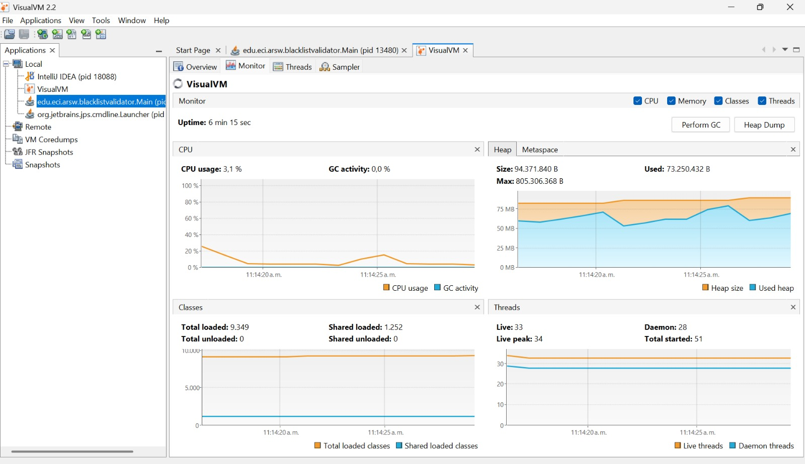

**Tantos hilos como núcleos**
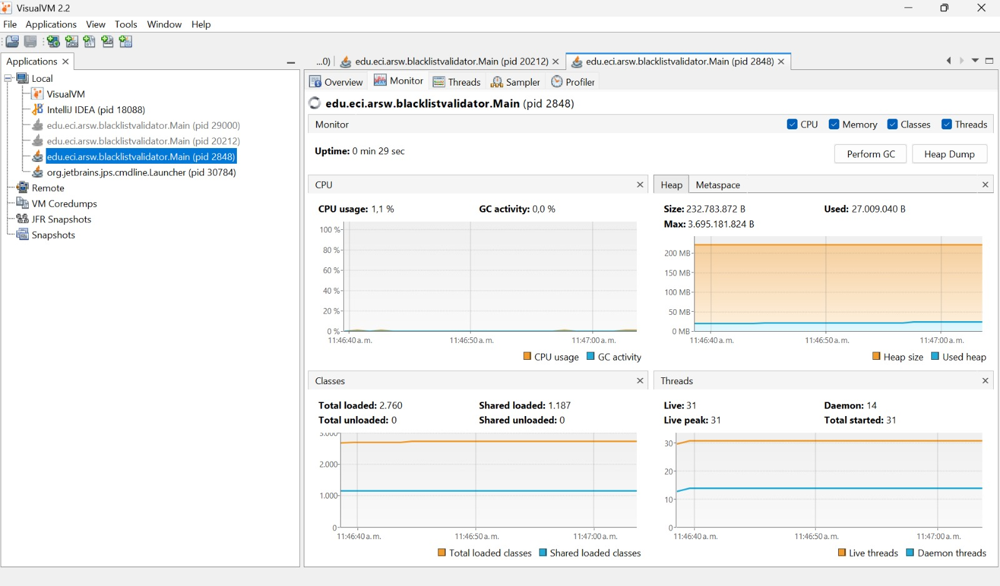

**Tantos hilos como el doble de núcleos**
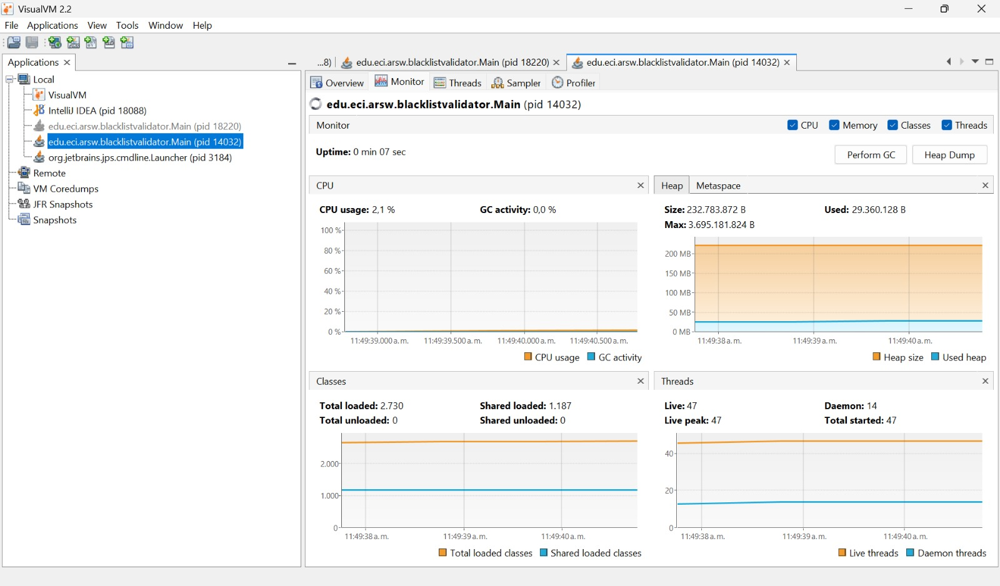

**50 hilos**
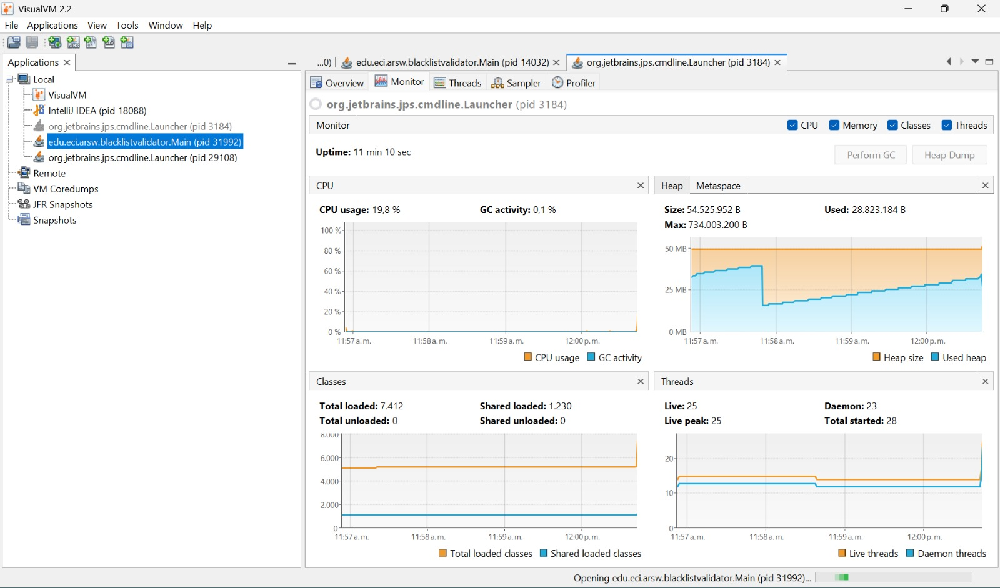

**100 hilos**
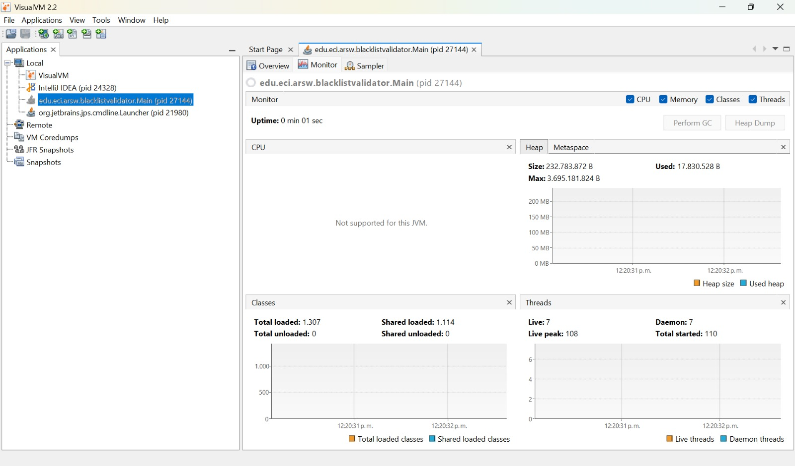

El experimento con la maquina 1demuestra que el uso de paralelismo reduce drásticamente el tiempo de ejecución del algoritmo de búsqueda. Sin embargo, el rendimiento no escala linealmente con el número de hilos. Existe un punto óptimo cercano al número de núcleos del procesador, a partir del cual el aumento de hilos produce rendimientos decrecientes debido al overhead de gestión y competencia por recursos del sistema.

---
#### MAQUINA 2:
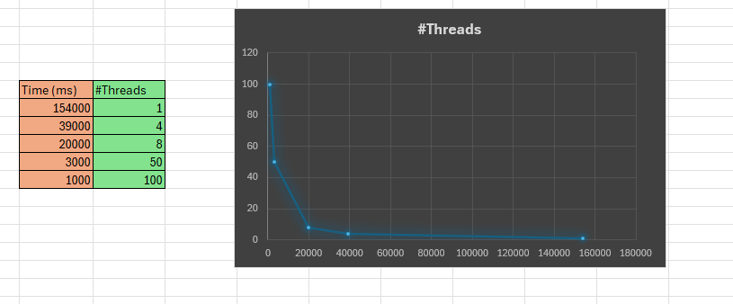
**1 Hilo**
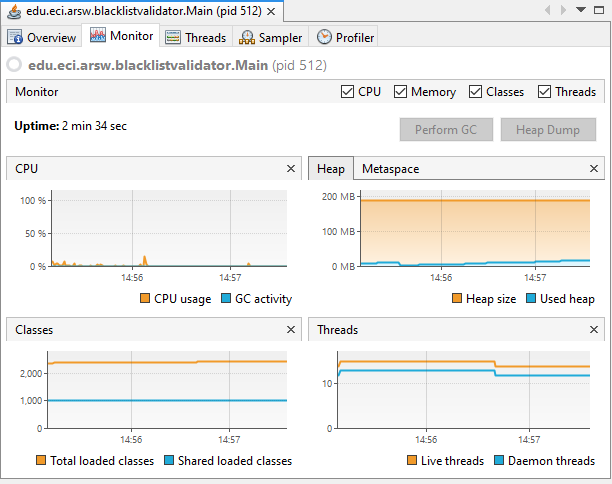
**Tantos hilos como núcleos**
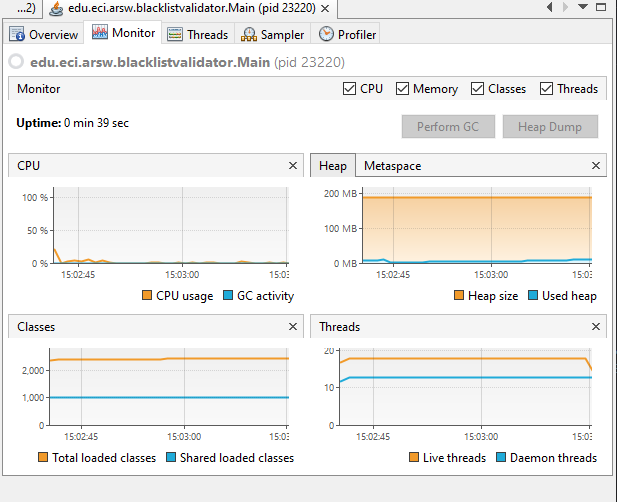
**Tantos hilos como el doble de núcleos**
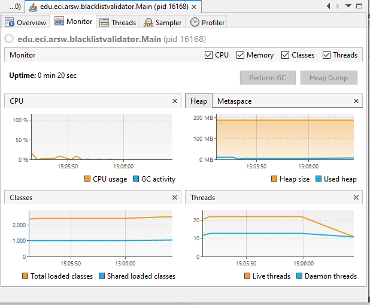
**50 hilos**
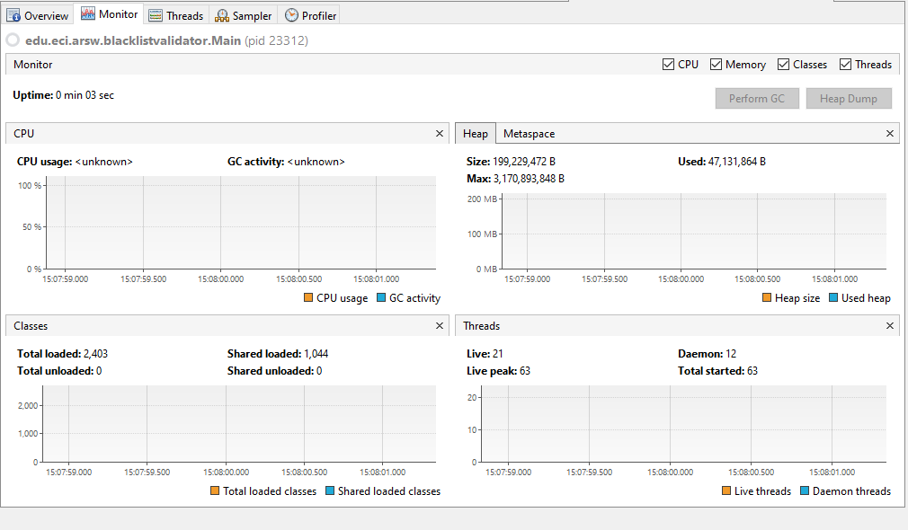
**100 hilos**
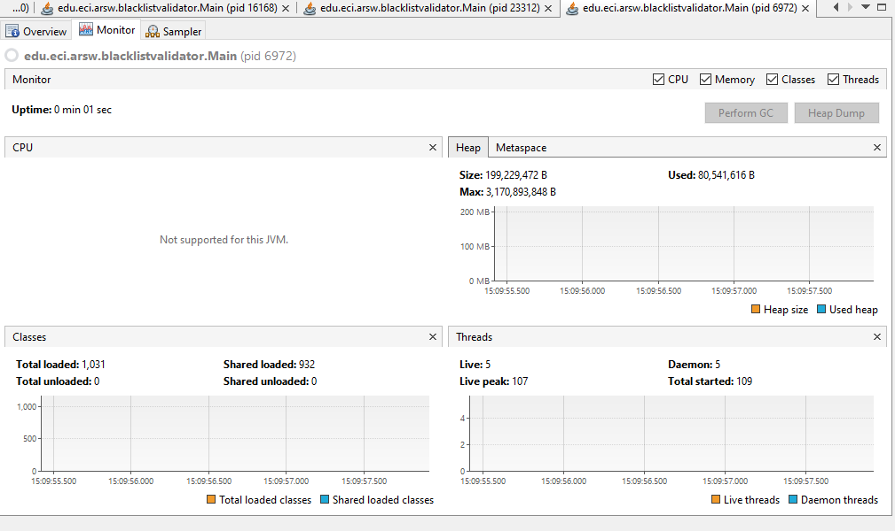
Los resultados en la máquina 2 validan la eficacia del paralelismo para acelerar la validación de IPs, pero con límites claros. La reducción de tiempo es drástica inicialmente (154s a 3s con 50 hilos), pero escalar a 100 hilos solo mejora en 2 segundos adicionales, demostrando la ley de rendimientos decrecientes. El overhead de gestión de hilos y la saturación de recursos del sistema explican esta meseta de rendimiento.

#### CONCLUSIONES GENERALES
Los experimentos en ambas máquinas demuestran que el paralelismo mediante múltiples hilos es efectivo para reducir tiempos de ejecución, pero su eficiencia depende críticamente de la arquitectura hardware subyacente. Mientras la escalabilidad muestra ganancias importantes hasta cierto punto (generalmente 2-4× el número de núcleos), threads adicionales introducen overhead que limita mejoras posteriores. La máquina 1, con mejor capacidad de procesamiento paralelo, mantiene gancias hasta más threads que la máquina 2, evidenciando que la optimización debe ser específica por entorno. El principio fundamental confirmado es: paralelizar sí, pero con medida y ajuste al hardware disponible.

---
**Parte IV - Ejercicio Black List Search**

1. Según la [ley de Amdahls](https://www.pugetsystems.com/labs/articles/Estimating-CPU-Performance-using-Amdahls-Law-619/#WhatisAmdahlsLaw?):

	, donde _S(n)_ es el mejoramiento teórico del desempeño, _P_ la fracción paralelizable del algoritmo, y _n_ el número de hilos, a mayor _n_, mayor debería ser dicha mejora. Por qué el mejor desempeño no se logra con los 500 hilos?, cómo se compara este desempeño cuando se usan 200?. 

Los resultados experimentales muestran que:
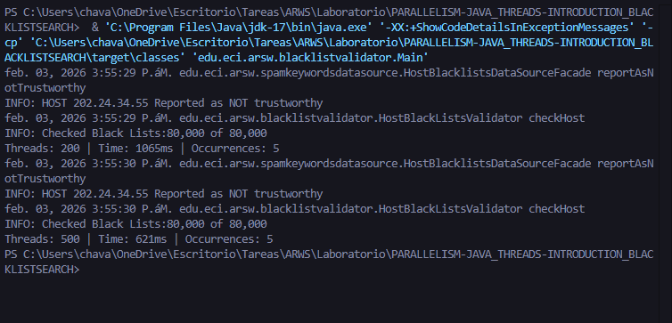

- **200 hilos**: 1065ms
- **500 hilos**: 621ms

Aunque 500 hilos es más rápido que 200, la mejora no es proporcional al aumento de hilos. Esto se debe a varios factores que limitan el desempeño:

**Factores que impiden el desempeño óptimo:**

1. **Porción no paralelizable del algoritmo**: La Ley de Amdahl establece que existe una fracción del programa que no puede paralelizarse (coordinación entre hilos, sincronización, consolidación de resultados). Esta porción secuencial se convierte en el cuello de botella que limita la aceleración máxima posible.

2. **Overhead de gestión de hilos**: Con 500 hilos, el sistema operativo debe:
   - Crear y destruir 500 hilos
   - Administrar el cambio de contexto entre ellos
   - Gestionar la sincronización y la memoria compartida
   
   Este overhead consume recursos computacionales que no contribuyen directamente a resolver el problema.

3. **Contención de recursos**: Con un número limitado de núcleos físicos (típicamente 4-16 en las máquinas de prueba), los 500 hilos compiten por:
   - Tiempo de CPU
   - Caché del procesador
   - Acceso a memoria
   - Ancho de banda del bus de memoria

4. **Context Switching**: Cuando el número de hilos excede significativamente el número de núcleos, el sistema operativo debe realizar cambios de contexto frecuentes, lo cual:
   - Consume tiempo de CPU
   - Invalida cachés
   - Reduce la eficiencia general

**Comparación 200 vs 500 hilos:**

La mejora de 200 a 500 hilos es de aproximadamente 1.88x en tiempo (1148ms → 609ms), pero se utilizaron 2.5x más hilos. Esto demuestra rendimientos decrecientes: cada hilo adicional contribuye menos a la mejora del desempeño.

Si comparamos con las pruebas anteriores (datos del README):
- **Máquina 1**: 1 hilo → varios segundos; 100 hilos → ~1-2s
- **Máquina 2**: 1 hilo → 154s; 50 hilos → 3s; 100 hilos → 1s

Vemos que el mayor salto de desempeño ocurre al pasar de 1 hilo a un número cercano al doble de núcleos. Después de ese punto óptimo, las mejoras son marginales debido a la Ley de Amdahl y el overhead mencionado.

2. Cómo se comporta la solución usando tantos hilos de procesamiento como núcleos comparado con el resultado de usar el doble de éste?.

**Respuesta:**

Basándose en los datos experimentales del README:

**Máquina 1:**
- **Tantos hilos como núcleos**: Tiempo reducido significativamente comparado con 1 hilo
- **Doble de hilos que núcleos**: Mejora adicional, aunque no proporcional

**Máquina 2:**
- **Tantos hilos como núcleos**: Reducción dramática de tiempo
- **Doble de hilos que núcleos**: Mejora adicional moderada

**Análisis:**

1. **Hilos = Núcleos**: Esta configuración es generalmente óptima porque:
   - Cada hilo puede ejecutarse en un núcleo físico sin competencia
   - Se minimiza el context switching
   - Se maximiza el uso de caché L1/L2 de cada núcleo
   - Overhead de sincronización es relativamente bajo

2. **Hilos = 2 × Núcleos**: Mejora adicional debido a:
   - **Hyperthreading/SMT**: Los procesadores modernos pueden ejecutar 2 hilos por núcleo físico
   - **Ocultamiento de latencia**: Mientras un hilo espera por I/O o memoria, otro puede ejecutarse
   - **Mejor utilización**: Compensa períodos de inactividad de cada hilo

Sin embargo, la mejora de usar el doble de hilos vs. el número de núcleos es menor que la mejora de pasar de 1 hilo al número de núcleos. Esto confirma que existe un punto de rendimientos decrecientes.

**Conclusión**: Usar el doble de núcleos es beneficioso, pero la mejora no es proporcional. El punto óptimo generalmente está entre N y 2N hilos (donde N = número de núcleos), dependiendo de la naturaleza del problema y la arquitectura del hardware.

3. De acuerdo con lo anterior, si para este problema en lugar de 100 hilos en una sola CPU se pudiera usar 1 hilo en cada una de 100 máquinas hipotéticas, la ley de Amdahls se aplicaría mejor?. Si en lugar de esto se usaran c hilos en 100/c máquinas distribuidas (siendo c es el número de núcleos de dichas máquinas), se mejoraría?. Explique su respuesta.

**Respuesta:**

**Escenario 1: 1 hilo en cada una de 100 máquinas**

La Ley de Amdahl **NO se aplicaría mejor**, de hecho, el rendimiento sería **significativamente peor** debido a:

1. **Latencia de red**: La comunicación entre máquinas distribuidas introduce latencias de red (milisegundos a segundos), mucho mayores que la comunicación entre hilos en la misma máquina (nanosegundos a microsegundos).

2. **Overhead de coordinación distribuida**: 
   - Sincronización de resultados entre 100 máquinas
   - Detección de la condición de parada (cuando se encuentran ≥5 ocurrencias)
   - Consolidación de resultados finales

3. **Ineficiencia de recursos**: Cada máquina ejecutaría solo 1 hilo, desperdiciando los demás núcleos disponibles.

4. **Sobrecarga de infraestructura**: 
   - Gestión de 100 conexiones de red
   - Serialización/deserialización de datos
   - Manejo de fallos de red y reintentos

Para este problema específico (blacklist search), la penalización por distribución superaría ampliamente los beneficios, ya que el problema es computacionalmente intensivo pero con mínima latencia de I/O local.

**Escenario 2: c hilos en 100/c máquinas distribuidas**

Este enfoque **SÍ mejoraría** comparado con el escenario anterior, pero **aún sería inferior** a la ejecución en una sola máquina potente por las siguientes razones:

**Ventajas del modelo híbrido:**
- **Mejor utilización de recursos**: Cada máquina usa todos sus núcleos (c hilos)
- **Menor overhead de red**: Menos máquinas = menos comunicación distribuida
- **Paralelismo multinivel**: Paralelismo intra-máquina (hilos) + inter-máquina (distribución)

**Desventajas persistentes:**
- **Latencia de red**: Sigue presente, aunque reducida
- **Complejidad de coordinación**: Aún se requiere sincronización distribuida
- **Overhead de comunicación**: Consolidación de resultados entre 100/c máquinas
- **Problema de detección temprana**: Dificultar la implementación de "early stopping" cuando se encuentran 5 ocurrencias (todos los nodos deberían ser notificados)

**Aplicación de la Ley de Amdahl:**

La Ley de Amdahl se vería más favorecida con c hilos en 100/c máquinas porque:
- Mayor grado de paralelismo efectivo (c × (100/c) = 100 hilos de ejecución)
- Menor porción secuencial per-máquina

Sin embargo, aparece una **nueva porción no paralelizable**: la sincronización distribuida entre máquinas, que no existe en el modelo de memoria compartida.

**Conclusión General:**

Para este problema específico de búsqueda en blacklists:

1. **Óptimo local**: Ejecutar en una sola máquina con N a 2N hilos (donde N = número de núcleos).

2. **Distribución solo justificada si**:
   - El dataset es tan grande que no cabe en una sola máquina
   - El tiempo de procesamiento es extremadamente largo (horas/días)
   - Se requiere alta disponibilidad y tolerancia a fallos

3. **Para problemas "embarrassingly parallel"** como este, la memoria compartida es superior a la distribución cuando es viable, porque:
   - Menor latencia de comunicación
   - Sincronización más eficiente
   - Detección temprana de condiciones de parada
   - Menor complejidad de implementación

La Ley de Amdahl favorece el uso de recursos locales eficientemente antes de distribuir, porque la distribución introduce su propia porción no paralelizable (comunicación y coordinación de red).

